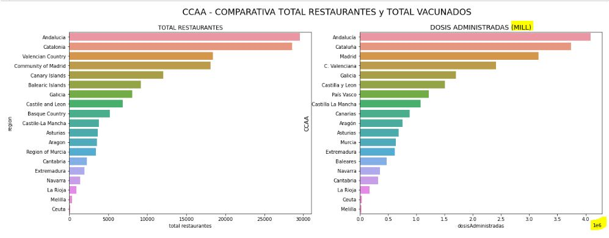

# PROYECTO DATA ANALYTIC -> TRIPADVISOR - VACUNAS (SPAIN) 

Dada la situación actual que se está viviendo en el país y el mundo (COVID) y a la reciente flexibilización de las normas y al gran ánimo de los ciudadanos de querer salir a divertirse o ya sean los recuentros familiares, es la gran oportunidad que la hostelería llevaba esperando para poder reabrir o mantener la viabilidad de sus negocios, sumado a esto los buenos resultados que está teniendo España respecto a la Vacunación.

**OBJETIVO:** Es fomentar el turismo Nacional y generar una buena imagen a nivel internacional, en base a la relación entre las dosis administradas por Comunidad Autonoma (CCAA) y los distintos restaurantes que se puede encontrarel usuario en cada CCAA.

**Observaciones** 
El Dataset(.csv) de TripAdvisor es a nivel Europa, pero nos quedamos solo con el de España, si el lector prefiere puede explorar otros países de Europa. 

Los datos de las vacunas viene en formato json, al inicio resulta algo complicado poder visualizarlo, pero ¡es posible!. 

## Focus 
Gran parte del trabajo se va a centrar en: 

1. Dosis Administradas por cada CCAA
    - Una Dosis VS Dosis Completa
    - Dosis distribuidas: Pfizer | Astrazeneca | Moderna | Janssen
2. Total de restaurantes por CCAA que están en tripdvisor.
    - Datos de interes para los usurios: buscar por comida vegana, rango de precios, tipo de cocina(Mediterranean, European, Italian, etc...), valoraciones respecto a la comida, servicio, atmosphera.   

 

## FUENTE DE DATOS
* El **DATASET de TripAdvisor** proviene de la plataforma de Kaggle.
 
    Aquí os dejo el link por si queréis echarle un ojo:
    - <https://www.kaggle.com/teajay/global-shark-attacks>
* Los **datos extraidos de la VACUNA (Spain)** vienen de la siguiente página web:
    - <https://covid-vacuna.app/>

## Librerias usadas para la limpieza y el análisis de datos:
      
               - Library Pandas
               - Library Numpy
               - Library Seaborn
               - Library Matplotlib
               - Library Lux
               - Library Folium
               - Library Streamlit
               - Mongo DB (pymongo)